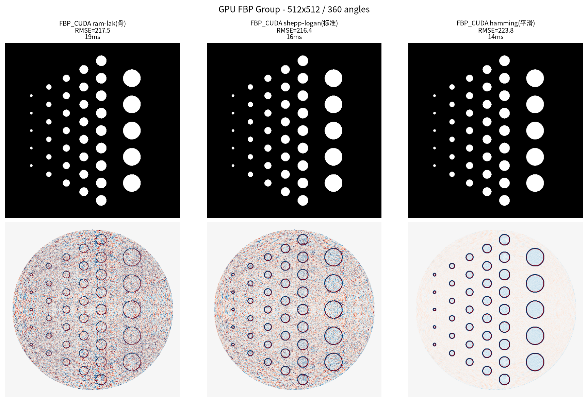
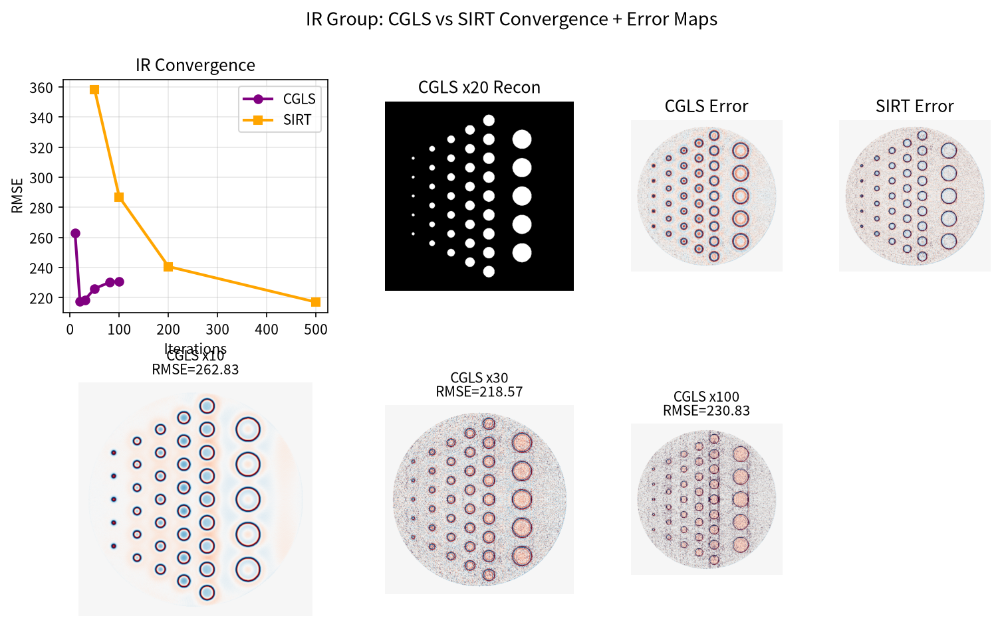
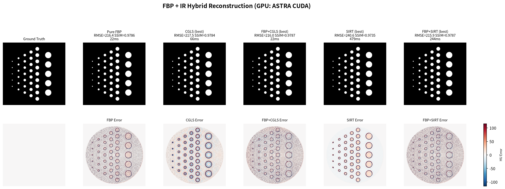
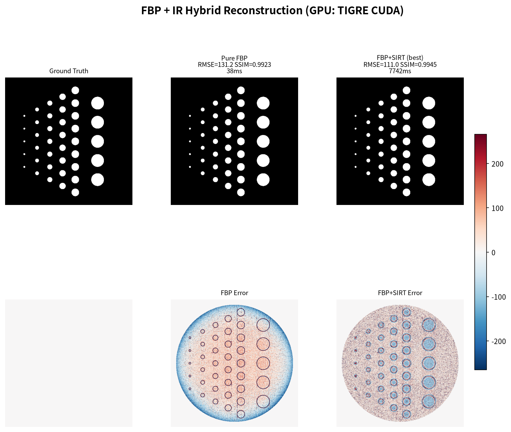
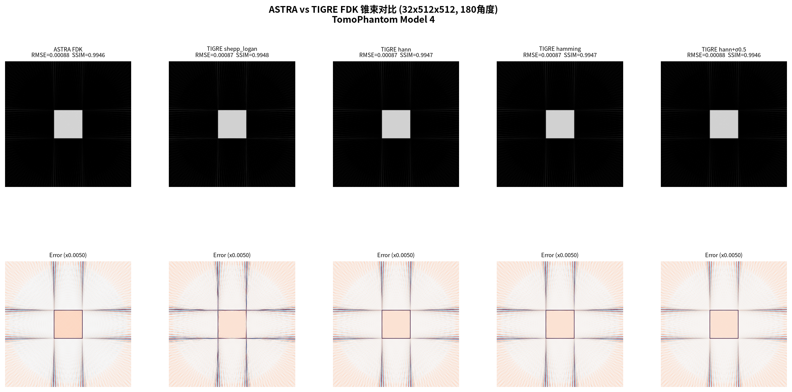
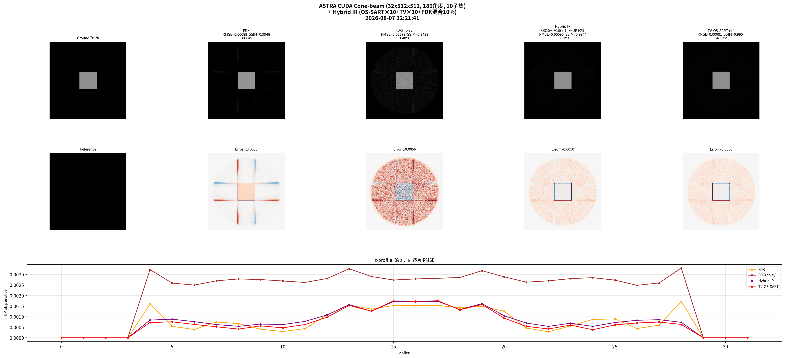
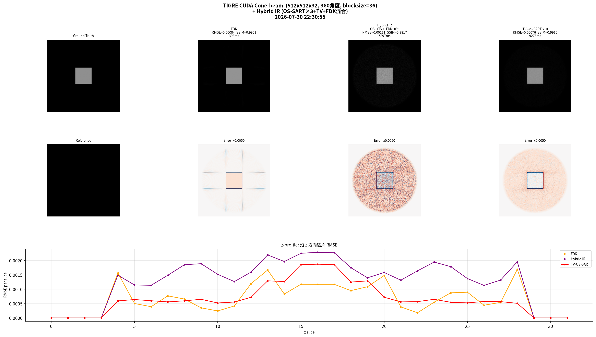
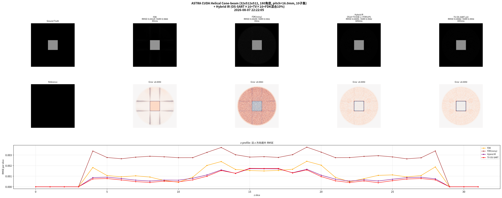
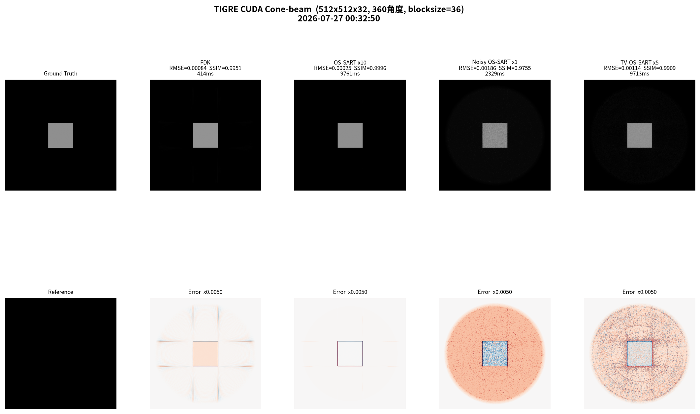

# easy learn tomographic reconstruction 
* 数学基础 Radon 变换 + 傅里叶切片定理
* fbp vs ir
* fbp add ir
* based gpu (astra-toolbox and tigre)
* tomophantom (体模生成库)
* rtk (not run on gpu directly,now not used.)
* axial and helical (now ,just axial)
## env 

uv cuda cupy astra tigre tomophantom matplotlib

## examples

### batch_view.py
 dicom to picture 
### fbp_vs_ir.py 

* fbp filters
<!---->
<!---->
fbp vs ir 
## 2d fan hybrid
sirt os-sart
### astra_hybrid.py
<!---->
### tigre_hybrid.py
<!---->

## axial cone hybrid
tv-os-sart+fdk
### fdk filter 

### astra_cone_hybrid.py

### tigre_cone_hybrid.py
tigre_hybrid

## helical cone hybrid
tv-os-sart+fdk
### astra_cone_hybrid.py

### tigre_cone_hybrid.py
tigre_hybrid

## result
[optimize #010](doc/optimize.md)
select astra(gpu) for production
select tigre(gpu) for research
select rtk for cpu

## TODO

add production model
clibration
c++ code

## install

note:tigre and tomophantom need install by github path
[install_by_uv](doc/install_by_uv.md)

## option gpu moniter

https://github.com/msminhas93/nviwatch
cargo install nviwatch

nviwatch

## cupy

uv pip install cupy-cuda12x 2>&1 | tail -5

## cpp

cd src_astra_cpp
cmake -S . -B build
cmake --build build -j

.venv/bin/python src_astra_cpp/tools/make_phantom.py
src_astra_cpp/build/astra_axial    src_astra_cpp/data/vol_gt.raw img_3d_axial/astra_cpp
src_astra_cpp/build/astra_helical  src_astra_cpp/data/vol_gt.raw img_3d_helical/astra_cpp

### cpp python tools

.venv/bin/python src_astra_cpp/tools/make_phantom.py        # 1. 体模
.venv/bin/python src_astra_cpp/tools/make_sino_noisy.py both  # 2. 共享噪声 (轴向+螺旋)
src_astra_cpp/build/astra_axial    ...                       # 3. 重建 (自动加载噪声)
