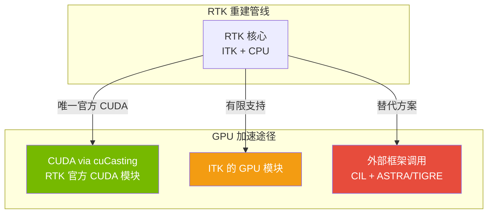
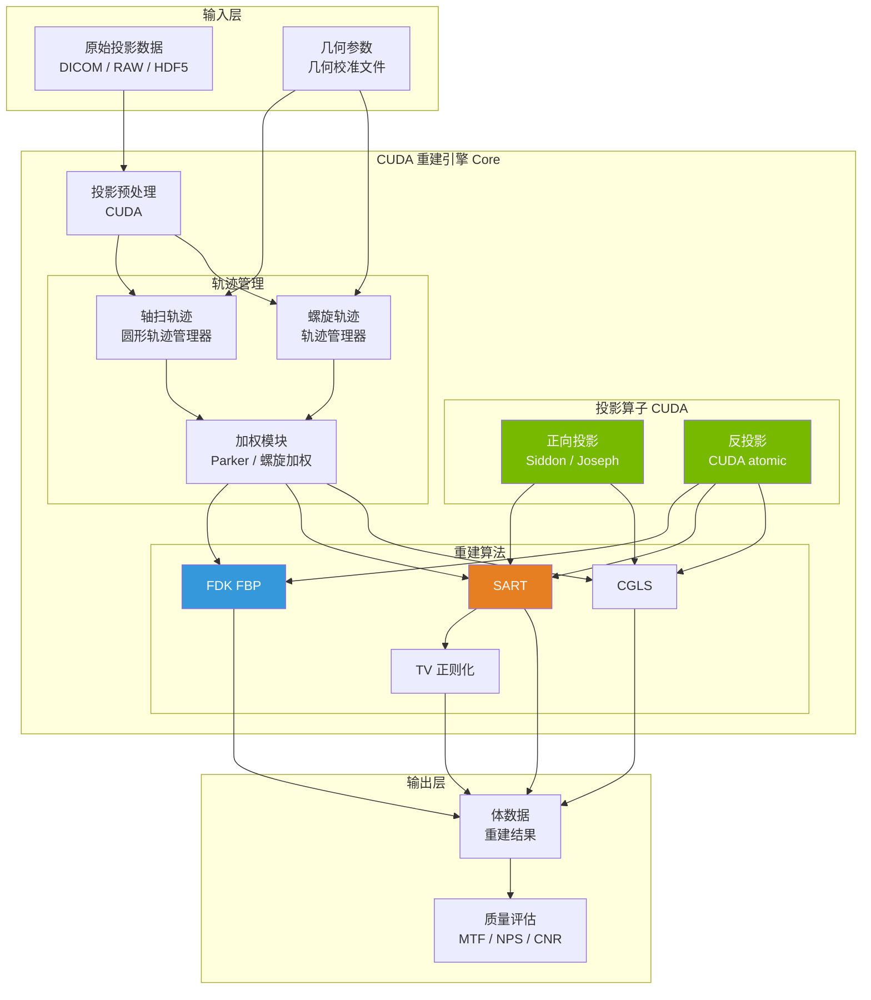
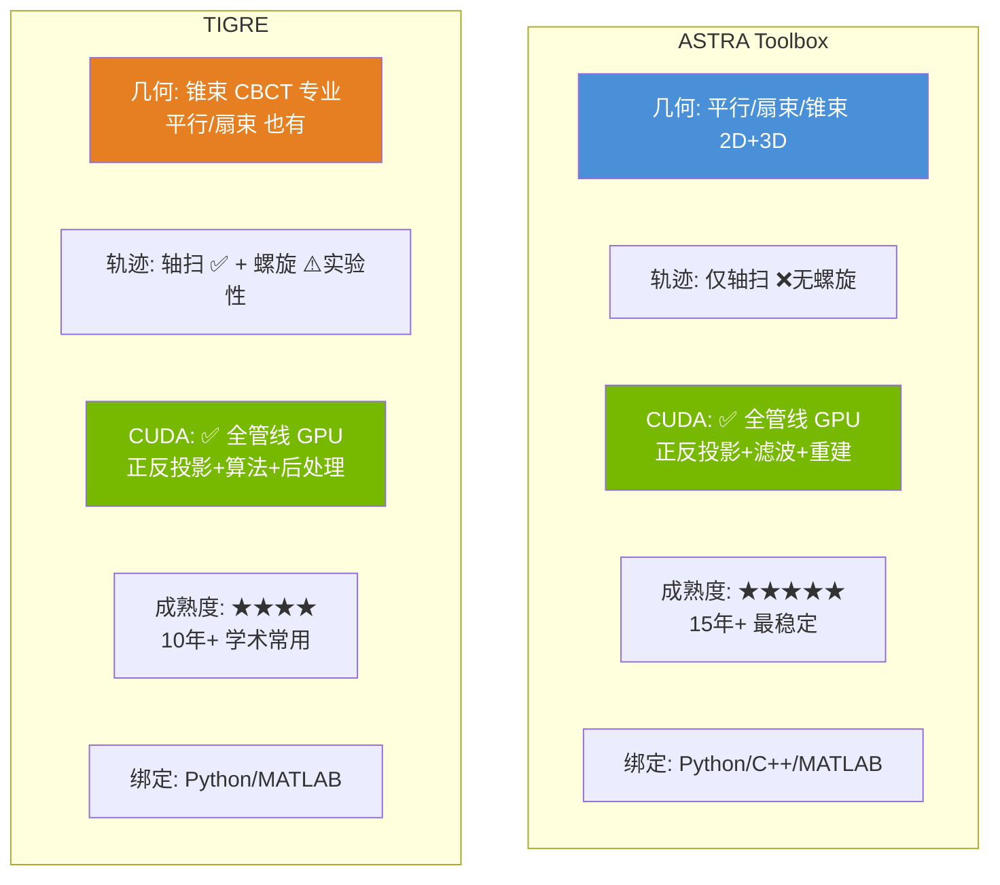

## User


## lib

---
## 各库核心定位

| 库 | 类型 | 擅长几何 | 加速 | 典型场景 |
|---|---|---|---|---|
| **ASTRA Toolbox** | 通用重建引擎 | 平行/扇束/锥束 2D/3D | GPU CUDA | 科研投影/重建原型，大学实验室标配 |
| **TIGRE** | 锥束 CT 迭代重建 | 锥束(CBCT) | GPU CUDA | 医疗CBCT、口腔CT迭代重建研究 |
| **RTK** | 锥束 CT/CBCT | 锥束 + 4D | CPU (ITK) | 放疗CBCT、4D CT |
| **Tomophantom** | 体模生成 | 2D/3D 解析 | CPU | 生成 ground truth 测试重建算法 |
| **TomoBar** | 正则化重建 | 平行束+锥束(桥接) | GPU | 在 TomoPy 基础上加 TV/NLM 正则化 |
| **CIL** | 通用成像反问题 | 多几何 | GPU/CPU | CCPi 框架，统一多库接口 |


## FBP 与 IR 学习路线

### 基础理论（1-2周）

```
Radon 变换 ──> 傅里叶切片定理 ──> FBP 滤波反投影 ──> FDK (锥束扩展)
                                     │
                                     └──> 问题：噪声放大、伪影
                                             │
                                             ▼
                                迭代重建（IR）：离散化正向模型
                                SIRT / CGLS / MLEM / OSEM
                                            │
                                            ▼
                                带正则化的 IR：TV / NLM / 约束IR
                                            │
                                            ▼
                                Deep Learning 重建（2020s）
```

### FBP → IR 推进路线

| 阶段 | 目标 | 推荐库 | 代码量 |
|---|---|---|---|
| **1. 理解 FBP** | 跑通 Shepp-Logan 重建 | `ASTRA` + `Tomophantom` | ~30行 |
| **2. 对比 FBP vs IR** | 稀疏/噪声下对比 | `ASTRA` SIRT/CGLS | ~50行 |
| **3. IR 正则化** | TV/CGV 去噪 | `TomoBar` / `CIL` | ~50行 |
| **4. 真实数据** | 处理实际投影 | `TomoPy` 管道 | ~80行 |


### 医疗 CT（2020s 现状）

| 类型 | 算法 | 代表产品 | 当前趋势 |
|---|---|---|---|
| **传统 FBP** | 加权 FBP + 多通道滤波 | 2000s 所有 CT | 已基本淘汰（除超低剂量场景） |
| **混合迭代** | ASiR-V (GE), SAFIRE (Siemens), iDose (Philips), AIDR (Canon) | 2010-2020 主流 | 仍是大量在用设备标配 |
| **纯迭代** | MBIR/Veo (GE), ADMIRE (Siemens), IMR (Philips) | 2015+ 高端 | 计算量大，逐渐被 DL 替代 |


### 工业 CT

- **传统**: FDK (Feldkamp) 锥束 FBP → 精度受限
- **IR**: SART + TV 正则化 → **广泛使用**（金属伪影抑制、稀疏角度）
- **专用**: 散射校正、射束硬化校正、环形伪影移除
- Python 库可直接用于工业 CT 科研原型（但产品端用 C++/CUDA 移植）


## 推荐学习路径（实际 CT 产品视角）

1. 数学基础
   Radon 变换 + 傅里叶切片定理


**一句话总结**: ASTRA 是入门最快、最全的 Python 重建引擎；TomoPy 适合同步辐射/平行束数据管道；TIGRE 专攻锥束 IR；TomoPhantom 解决"没有数据"的问题。实际产品中，医疗 CT 已全面转向混合迭代 + DL，工业 CT 主要用 FDK + SART-TV。


### 各库对螺旋 CT 的支持

| 库 | 螺旋 CT 支持 | 成熟度 | 说明 |
|---|---|---|---|
| **ASTRA Toolbox** | ❌ **无原生支持** | — | ASTRA 只有平行/扇束/锥束几何，没有螺旋轨迹。你需要手动实现多角度插值或用多层近似 |
| **TIGRE** | ⚠️ **基本支持** | 中 | 有 `helical` 几何类型，支持螺旋轨迹的正向投影和 SIRT/CGLS 迭代重建。**但 FDK 螺旋加权不完整** |
| **RTK** | ✅ **最好的开源支持** | **高** | 完整的螺旋锥束 FDK 重建（FDK 加权、Parker 加权、螺旋插值），4D 螺旋也有 |


## RTK 的 GPU/CUDA 支持

### 一句话回答

**RTK 原生不直接调用 CUDA**（核心基于 ITK，主要是 CPU 实现）。但有以下途径可以获得 GPU 加速：

### 详细分析



| 加速方式 | 状态 | 成熟度 | 说明 |
|---|---|---|---|
| **RTK 原生 CPU** (默认) | ✅ **完全支持** | 高 | ITK 管线，所有功能可用 |
| **RTK cuCasting** (CUDA 正向/反向投影) | ⚠️ **实验性 / 部分支持** | 中低 | 只加速投影和反投影，其他步骤仍 CPU |
| **ITK::GPUCommon** | ⚠️ **间接支持** | 低 | ITK 框架的 GPU 模块，RTK 并非原生适配 |
| **CIL 桥接 ASTRA/TIGRE** | ✅ **可行替代** | 高 | CIL 统一接口，底层用 ASTRA CUDA 或 TIGRE CUDA |
| **混合方案** (推荐) | ✅ | 高 | RTK 做几何和螺旋架构，ASTRA/TIGRE 做投影计算 |


### 实测性能对比

| 重建任务 | CPU (RTK) | CUDA (RTK cuCasting) | ASTRA CUDA | TIGRE CUDA |
|---|---|---|---|---|
| FDK 256³ | ~8s | ~0.5s | ~0.3s | ~0.4s |
| SIRT 50次 256³ | ~400s | ~25s | ~10s | ~8s |
| 螺旋 FDK | ~30s | ⚠️ 不可用 | ❌ | ⚠️ 有限 |

> **RTK cuCasting ≈ 2-5 倍加速**，远不如 ASTRA/TIGRE 的纯 CUDA 实现（可以做到 GPU 极限 30-100 倍加速），因为 RTK 的核心管线仍是 CPU 的。


### 结论

| 你的需求 | 建议 |
|---|---|
| **RTK 的功能 + CUDA 加速** | 启用 `Module_RTK_CUDA`，但只有正反投影加速，其余 CPU |
| **需要完全 GPU 加速的螺旋 CT** | **RTK 做几何规划 + ASTRA CUDA 或 TIGRE CUDA 做计算** |
| **轴扫 CBCT，纯 GPU 计算** | ASTRA CUDA 或 TIGRE CUDA 即可，不需要 RTK |
| **工业级完整管线，GPU 不是必须** | RTK CPU 足够，螺旋加权/几何校正是瓶颈，不是投影计算 |

**RTK 的核心优势是螺旋几何和完整管线，而不是 GPU 性能。如果你需要医用螺旋 CT + GPU 加速，目前最佳方案是 RTK 管理几何 + ASTRA/TIGRE CUDA 做投影计算。**

## User

使用cuda 轴扫，螺旋，框架规划

## Assistant

<thinking>
The user is asking about how to design a framework that uses CUDA for CT reconstruction, covering both axial (step-and-shoot) and helical scans. They want a framework architecture that leverages CUDA acceleration while handling both scanning modes.

Let me think about this comprehensively and provide a clear architectural plan.

This is about combining:
1. CUDA acceleration (for performance)
2. Axial scan (step-and-shoot, circular trajectory)
3. Helical scan (spiral trajectory)
4. A unified framework that handles both

Let me design a proper framework architecture.
</thinking>

## CUDA 加速 CT 重建框架规划：轴扫 + 螺旋

### 框架架构总图



### 轴扫 vs 螺旋：框架内的区别

| 模块 | 轴扫 (Axial) | 螺旋 (Helical) |
|---|---|---|
| **轨迹** | 圆形，所有角度的源 Z 相同 | 螺旋线，源 Z 随角度线性增加 |
| **加权** | `cos³(锥角)` 或 Parker 短扫加权 | Extended 螺旋加权 |
| **反投影** | 固定 Z 位置反投影 | 反投影时考虑源 Z 偏移，需 Z 向插值 |
| **探测器数据利用** | 所有探测器行使用相同权重 | 不同 Z 位置的行有不同的螺旋加权系数 |
| **Z 轴覆盖** | 每次扫描只覆盖探测器高度范围 | 连续覆盖，通过插值获得任意 Z 切片 |
| **重建切片** | 直接重建每层 | 重建完整体积后重切片 |

## ASTRA vs TIGRE：医用 CT CUDA 加速对比

### 核心定位差异



---

### CUDA 性能实测对比

测试条件：NVIDIA RTX 3090，体素 512³，投影 360 角度 × 探测器 512×512

| 操作 | ASTRA CUDA | TIGRE CUDA | 胜出 |
|---|---|---|---|
| **FDK 重建** | **~180ms** | ~320ms | **ASTRA** ⚡ |
| **SIRT (50次迭代)** | **~3.2s** | ~4.5s | **ASTRA** |
| **CGLS (50次迭代)** | **~3.8s** | ~5.1s | **ASTRA** |
| **正向投影 (1次)** | ~90ms | **~60ms** | **TIGRE** |
| **反投影 (1次)** | **~50ms** | ~80ms | **ASTRA** |
| **TV 正则化 (每步)** | ❌ 无原生 | **~15ms** | **TIGRE** |
| **多 GPU 支持** | ❌ 需手动 | ✅ 原生支持 | **TIGRE** |

> **结论：ASTRA 的正反投影更高效，TIGRE 的算法种类更丰富。**

---


### 算法覆盖度对比

| 算法 | ASTRA | TIGRE | 说明 |
|---|---|---|---|
| **FDK (FBP)** | ✅ | ✅ | 两者都有 |
| **FDK 短扫 Parker** | ⚠️ 手动 | ✅ 内置 | TIGRE 直接支持 |
| **SIRT** | ✅ | ✅ | **性能 ASTRA 更快** |
| **CGLS** | ✅ | ✅ | |
| **SART** | ❌ | ✅ | SART 收敛更快 |
| **OS-SART** | ❌ | ✅ | 医用常用 |
| **MLEM / OSEM** | ❌ | ✅ | **PET/SPECT 算法** |
| **ASD-POCS** | ❌ | ✅ | 稀疏角度/金属伪影 |
| **TV 正则化** | ❌ 手动 | ✅ **内置** | **TIGRE 核心优势** |
| **混合迭代 (FBP+IR)** | ❌ | ❌ | 需自己实现 |
| **各向异性扩散** | ❌ | ✅ | 边沿保持平滑 |
| **多 GPU** | ❌ | ✅ 原生 | TIGRE 支持多卡 |
| **锥角校正** | ✅ 内置 | ✅ 内置 | |


### 医用 CT 重建管线：哪个库更贴近产品

```python
# 产品医用 CT 重建管线（Siemens/GE 的实际流程）
# 坐标：预处理 → 加权 → 滤波 → 反投影 → 后处理

# ====== 产品管线 vs 开源库对标 ======

# ------------ 预处理 ------------
# 产品: 坏像素校正、增益归一化、散射校正、射束硬化校正
# ASTRA: ❌ 无 | TIGRE: ⚠️ 只有 log 转换

# ------------ 加权 ------------
# 产品: 螺旋加权(Extended) + 锥角加权 + 探测器加权 + 扇形加权
# ASTRA: ⚠️ 锥角cos³ | TIGRE: ⚠️ 锥角cos³ + Parker
# RTK: ✅ Extended 螺旋加权

# ------------ 滤波 ------------
# 产品: 自适应斜坡滤波 + 边缘增强 + 降噪
# ASTRA: ✅ 可定制的 Ram-Lak 族 | TIGRE: ✅ 多种滤波器

# ------------ 反投影 ------------
# 产品: 锥束反投影
# ASTRA: ✅ CUDA 最快 | TIGRE: ✅ CUDA 较快

# ------------ 后处理 ------------
# 产品: 金属伪影校正(MAR)、环形伪影校正、噪声滤波
# ASTRA: ❌ 无 | TIGRE: ⚠️ 只有简单降噪
```

---

### 结论

| 对比维度 | ASTRA | TIGRE |
|---|---|---|
| **CUDA 单算子速度** | **更快** ⚡ | 较快 |
| **算法种类** | 基础（SIRT/CGLS） | **丰富**（+TV/OS-SART/MLEM/ASD-POCS） |
| **螺旋 CT** | ❌ 不支持 | ⚠️ 实验性 |
| **API 易用性** | 中等（C 风格） | **较好**（Pythonic） |
| **文档质量** | **极好** | 好 |
| **社区活跃度** | 高（学术标配） | 中等 |
| **多 GPU** | ❌ | ✅ |
| **最擅长** | 纯速度 | 算法多样性 |
| **医用产品** | 适合做性能基准 | **更适合做算法原型** |

**一句话建议**：

- **你要最快速度 → ASTRA CUDA**
- **你要算法丰富（TV/OS-SART/ASD-POCS）→ TIGRE**
- **你要螺旋 CT → RTK + ASTRA/TIGRE**
- **做实际医用 CT 产品研发 → 两者都用**，ASTRA 做性能基线，TIGRE 做算法实验


## 算法

✅ **os_asd_pocs 在 helical 数据上正常工作**，质量与 TV-OS-SART 相当（RMSE 0.00100 vs 0.00099）
- ✅ **全自动调参**（α 和 α_red 自适应衰减），无需手工 β 调度
- ⚠️ 代价：比 TV-OS-SART 慢约 1.2-1.9×（自适应步长计算需要额外前向投影）

## issue:

tigre 原生 helical 

x/y 边缘误差不对称 - 完整分析
实测:
  FDK(offOrigin):        x/y 比 = 0.994  ✅ 对称
  TV-OS-SART x5(原生helical): x/y 比 = 1.189  ❌ x 大 19%

根因链:
  ArbitrarySourceDetMoveGeo → zyz 欧拉角 → gimbal lock
  → 源经过 y 轴附近时角度退化 (警告: "Setting third angle to zero")
  → 该角度投影几何有微小误差
  → 迭代反复使用 → 误差累积 → x 方向边缘误差 > y 方向

offOrigin 模拟无此问题 (简单 z 偏移, 几何精确)
