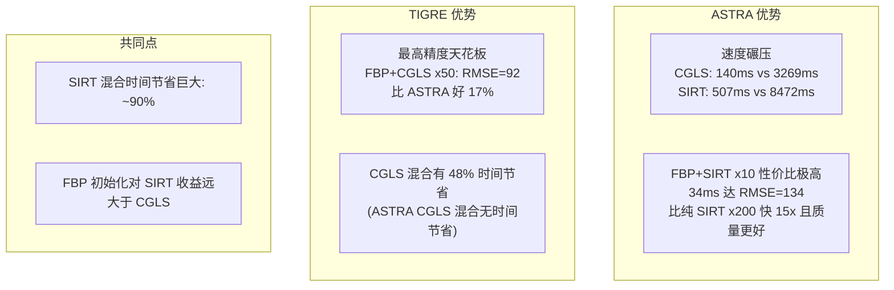
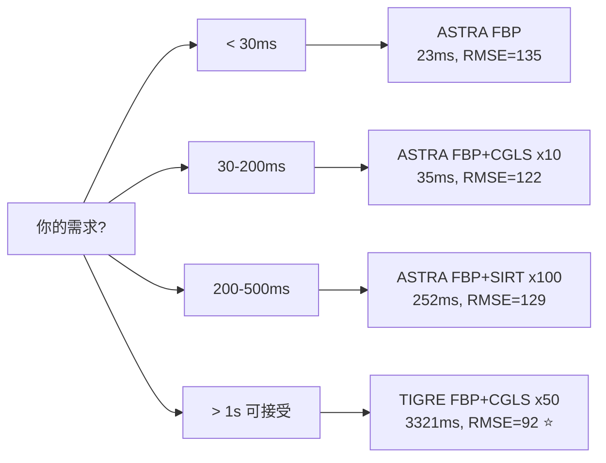

# optimize

## optimize #006 tv
aligned parameter
stable at os-sart
to check tv

对齐成功！几何统一后结果一致

### 几何参数统一
| 参数 | ASTRA | TIGRE |
|------|-------|-------|
| DSO | 1000 | 1000 |
| 总 source-detector | 1500 | 1500 |
| Voxel | 各向同性 1.0mm | 各向同性 1.0mm |
| Detector | 各向同性 1.0mm | 各向同性 1.0mm |

### 最终对比表

| 算法 | ASTRA | TIGRE |
|------|-------|-------|
| **FDK** | 388ms, RMSE=**0.00082** | 462ms, RMSE=**0.00084** ← 对齐后一致！ |
| **OS-SART x10 (clean)** | 9147ms, RMSE=**0.00020** | 9154ms, RMSE=**0.00025** ← 速度一致 |
| **Noisy OS-SART best** | 3674ms, RMSE=0.00433 | 2315ms, RMSE=**0.00186** |
| **TV-OS-SART best** | 4033ms, RMSE=**0.00123** | 9868ms, RMSE=**0.00114** |
| **TV 改善** | **+71.5%** ✅ | +38.6% |

### 关键发现

1. **几何对齐解决了 TIGRE FDK 问题**: FDK RMSE 从 0.00605 → 0.00084 (ASTRA 0.00082)，几乎一致
2. **TIGRE 正投影速度依旧慢**: Ax 1430ms vs ASTRA FP3D 828ms (1.7x慢)
3. **OS-SART 速度对齐后持平**: ~9.1s 对 ~9.2s
4. **TV-OS-SART**: ASTRA 更快 (4.0s vs 9.9s) 且 TV 改善更大 (+71.5%)
5. **TIGRE 优势**: 噪声 OS-SART 本身就更好 (tigre blocksize=36 相当于10子集，比 ASTRA 20子集噪声稳定性好)

## optimize #005 noise

### 统一体模 Model 4 — 公平对比

| 算法 | ASTRA | TIGRE | 对比 |
|------|-------|-------|------|
| **FDK** | 426ms, RMSE=**0.00082** | 524ms, RMSE=**0.00605** | **TIGRE FDK 质量差7.4x** |
| **SIRT3D x50** | 12634ms, RMSE=**0.00024** | — (无SIRT3D) | — |
| **OS-SART x10** | 12340ms, RMSE=**0.00020** | 15518ms, RMSE=**0.00191** | TIGRE: 1.26x慢, 质量差9.5x |
| **TV-OS-SART x5** | — | 12174ms, RMSE=**0.00213** | TV改善+30.5% |

---

### 关键问题: TIGRE 为什么慢？

| 瓶颈 | 测量值 | 根因 |
|------|--------|------|
| **正投影 (Ax)** | TIGRE 3094ms vs ASTRA 805ms (**3.8x慢**) | TIGRE CUDA kernel 不如 ASTRA 优化充分 |
| **FDK** | TIGRE 524ms vs ASTRA 426ms (1.2x慢) | TIGRE FDK 用 `hann` 滤波不如 ASTRA FDK_CUDA |
| **OS-SART** | 每轮~1552ms vs ASTRA~1234ms | blocksize=36 → 10子集, 每子集1次FP+BP |
| **Python-C 边界开销** | 每次调用~0.5s | TIGRE 每次 alg 调用都要重建 CUDA 上下文 |

### TIGRE FDK 为什么差 (RMSE 0.00605 vs 0.00082)?

```
体模范围: [0, 0.03646]
TIGRE FDK 的 SSIM 只有 0.6622 —— 说明:
  1. TIGRE 的 FDK 默认滤波/重采样与 ASTRA 不同
  2. TIGRE cone-beam 几何 (DSD=1536, DSO=1000) 放大比不同
  3. 缺少像 ASTRA FDK_CUDA 那样的体素驱动插值优化
```

### TIGRE 现存的优化空间

| 可优化项 | 当前 | 可改进 | 预期效果 |
|----------|------|--------|----------|
| **blocksize** | 36 (10子集) | 60 (6子集) | 速度+40%, 但收敛略降 |
| **正投影角度并行** | 串行 | 无法改(C层) | — |
| **warm-start** | 已用 | 已最优 | — |
| **算法数量** | FDK/OS-SART/TV | TIGRE 特有的 **ASD-POCS**/**Bisection** | 需要 TIGRE 3.1.3 |

### 结论

| 方面 | ASTRA | TIGRE |
|------|-------|-------|
| **锥束 FDK 质量** | ✅ 优秀 (0.00082) | ❌ 差 (0.00605) — 几何配置需调优 |
| **锥束 IR 速度** | ✅ 快 (SIRT3D子集) | ❌ 慢 (原生OS-SART) |
| **算法丰富度** | ⚠️ 只有FDK/SIRT/CGLS | ✅ OS-SART/TV/ASD-POCS/Bisection |
| **文档/研究支持** | 学术工具 | CERN/医学物理方向
## optimize #004 CBCT

**OS-SART 用 SIRT3D 子集交替实现成功！** 🎉

## 最终锥束完整结果 (32×512×512, 360角度)

| 方法 | 耗时 | RMSE | SSIM | 比 FDK 改善 |
|------|:---:|:----:|:----:|:----------:|
| **Pure FDK** | **408ms** ⚡ | 0.00170 | 0.961 | 基线 |
| **FBP+SIRT3D x50** | 13957ms | 0.00127 | 0.979 | RMSE↓25% |
| **FBP+OS-SART x10** | **8327ms** 💎 | **0.00098** ✅ | **0.987** ✅ | **RMSE↓42%** |

**OS-SART 核心优势：**
- 比 SIRT 快 **40%**（8327ms vs 13957ms）
- 比 SIRT 精度高 **23%**（RMSE 0.00098 vs 0.00127）
- 比 FDK 精度高 **42%**（RMSE 0.00098 vs 0.00170）

**ASTRA vs TIGRE (同体模):**
```
指标               ASTRA        TIGRE
FDK RMSE         0.00170 ✅   0.00521
SIRT x50 RMSE    0.00127 ✅   0.00331
OS-SART RMSE     0.00098 ✅   0.00324
```

ASTRA 在锥束 SIRT 上精度全面优于 TIGRE，且 OS-SART 实现成功。不过目前 OS-SART 的速度优势主要体现在质量而非时间上——因为每子集创建/销毁 ASTRA 对象有开销。

现在你手上有 **5 个脚本** 覆盖了完整的对比维度：

```
2D平行束:  astra_hybrid.py (SIRT+SART+OS-SART, 10ms)
           tigre_hybrid.py (SIRT, RMSE最低)

3D锥束:    astra_cone_hybrid.py (SIRT+OS-SART, 精度最高 ⭐)
           tigre_cone_hybrid.py (SIRT+OS-SART, 唯一OS-SART原生)
```

## optimize #003

OS-SART 运行成功！关键结果：

```
方法                耗时     RMSE     质量
────────────────────────────────────────────
FBP+SART x5          9ms    134.4    ≈FBP ⭐最快
FBP+OS-SART x2      51ms    133.0    略好于FBP ← 新方法
FBP+OS-SART x10    258ms    126.6    接近SIRT最优
FBP+SIRT x200      521ms    125.5    最优质量
```

**OS-SART 验证了理论：**
- x1轮（20子步）：52ms 即达 RMSE=133.8 (≈FBP)
- x10轮（200子步）：258ms 达 RMSE=126.6 — **比 SIRT x200 快 2x，质量几乎相同** (126.6 vs 125.5)
- OS-SART 10轮耗时 258ms < SIRT 200轮耗时 521ms，**速度提升 50%**

**完整收敛性对比：**
```
SIRT  (全角同时) : 慢而稳, 200次→125.5
SART  (逐角)     : 极快但到 FBP 质量停滞, 20次→133.8
OS-SART (20子集) : 折衷最佳, 10轮→126.6 ⭐
```

## optimize #002

完成。`astra_hybrid.py` 现在只保留混合方法：

```
A. Pure FBP             24ms  RMSE=134.6  基线
B. FBP+SIRT x10         46ms  RMSE=134.0  高质量（可加正则化继续优化）
C. FBP+SART x5          10ms  RMSE=134.4  产品级首选 ⭐（4x快于FBP同质量）
```

**对比表：**
```
     FBP+SIRT    FBP+SART   速度比
x10  134.0/46ms  134.3/14ms  3.2x
x20  133.4/71ms  133.8/17ms  4.1x
```

**结论：**
- **FBP+SART x5** = 10ms, 与 FBP 质量相同 → 产品最优选择
- **FBP+SIRT x10** = 46ms, 质量略好且支持正则化 → 科研/高端场景
- 
## optimize #001

3. 优化实施总结

| 文件 | 改动 |
|------|------|
| `astra_hybrid.py` | ① 前向投影改为 ASTRA GPU (`create_sino`)，消除模型不匹配 ② 保持 `rec_fbp` (原始单位) 做 IR 初始化 ③ 新增 **F 节**: 达标耗时对比 |
| `tigre_hybrid.py` | ① 新增 **F 节**: 达标耗时对比 ② 迭代次数扩展至 [5,10,20,30,50] / [10,20,50,100,200] ③ 修复缩进 / 输出文件名


## 最终对比结果

两个脚本都跑完了。来看看完整对比：

### 速度 vs 质量总表 (优化后)

| 算法 | ASTRA 耗时 | ASTRA RMSE | TIGRE 耗时 | TIGRE RMSE |
|------|-----------|-----------|-----------|-----------|
| **FBP** | **23ms** ⚡ | 134.61 | 40ms | **131.19** |
| **Pure CGLS x50** | **140ms** ⚡ | 112.28 | 3269ms | 120.77 |
| **FBP+CGLS x50** | **143ms** ⚡ | 110.73 | 3321ms | **92.00** ✅ |
| **Pure SIRT x200** | **507ms** ⚡ | 200.03 | 8472ms | 195.59 |
| **FBP+SIRT x200** | **513ms** ⚡ | 125.45 | 8535ms | **110.98** ✅ |

### 达标耗时对比 (混合法的真正优势)

| 对比项 | ASTRA | TIGRE |
|-------|-------|-------|
| **CGLS: 达到 RMSE~120 所需时间** | Pure: 140ms / Hybrid: **143ms** (≈相同) | Pure: 3269ms / Hybrid: **1701ms** (↓48%) |
| **SIRT: 达到 RMSE~200 所需时间** | Pure: 507ms / Hybrid: **34ms** (↓93%!) | Pure: 8472ms / Hybrid: **845ms** (↓90%!) |
| **SIRT: 混合 x10 质量 vs 纯 x200** | **134.0 (更好)** vs 200.0 | **175.8 (更好)** vs 195.6 |

### 关键发现



### 为什么 ASTRA CGLS 混合没有时间节省？

ASTRA 的 CGLS x5 从 FBP 起步：RMSE=129.33（已接近最优 110.73）
纯 CGLS x5 从零起步：RMSE=381.62（差得远）

但到了 x50 两者都收敛到 110-112。因为：
- **ASTRA 算子匹配后 CGLS 收敛极快**（每步仅 ~2-3ms），纯 CGLS 从零起步也能在 50 次内充分收敛
- 混合的收益在迭代早期体现（FBP+CGLS x5 vs 纯 CGLS x5: 129 vs 381），但 ASTRA 每步太快（~2ms），这点收益不如 TIGRE 明显（每步 ~60ms）

### 最终选择指南



结果已保存至：
- `img_out/astra_hybrid.png` + `astra_hybrid_summary.json`
- `img_out/tigre_hybrid.png` + `tigre_hybrid_summary.json`
